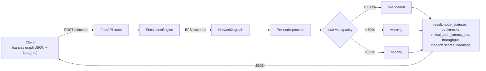
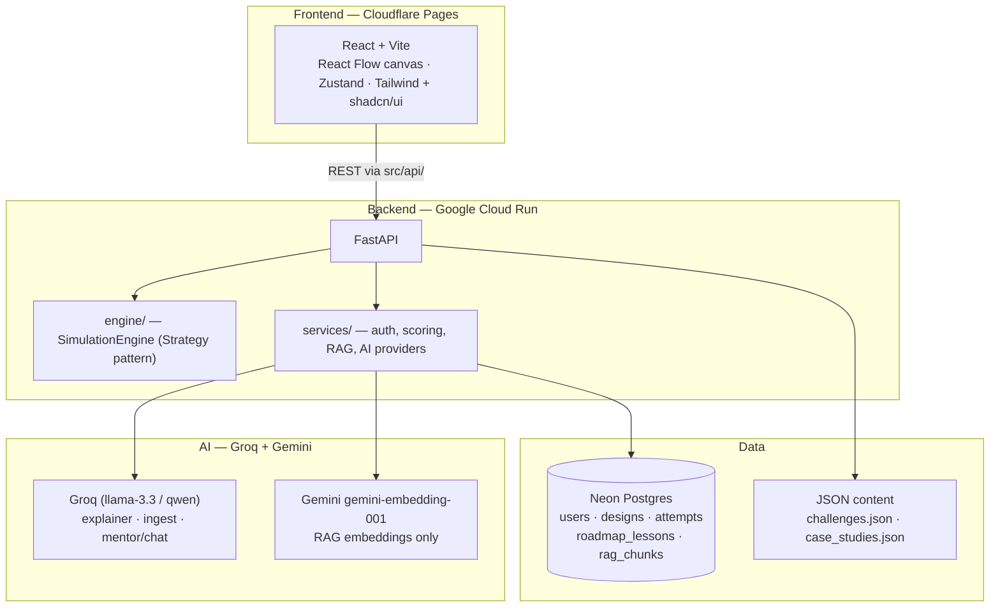
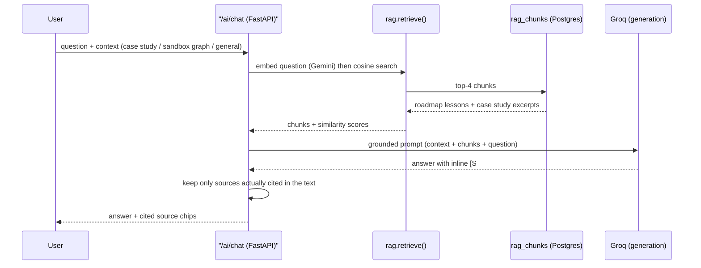

<div align="center">

# SystemSim

**Learn distributed systems by building them, breaking them, and watching why.**

Design architectures on a visual canvas, throw load at them, and watch the
bottlenecks light up in real time — backed by an original 14-component
simulation engine, 76 structured system-design lessons, real company
incident write-ups, and a RAG-grounded AI mentor.

[](LICENSE)
[](frontend)
[](backend)
[](#tech-stack)

</div>

---

## What is this?

Most system-design learning is passive: read a blog post, watch a video,
memorize "use a cache here." SystemSim flips that — you drag components onto
a canvas, wire them together, set a request rate, and hit **Simulate**. The
engine traces load through your graph node by node and tells you exactly
which one falls over first, and why.

Three ways to learn:

| Mode | What it is |
|---|---|
| 🎛️ **Sandbox** | Free canvas — drag/connect/configure 14 components, set load, simulate, get bottleneck highlights + a tradeoff score (consistency / availability / scalability / latency / cost / complexity). |
| 🏆 **Challenges** | Structured briefs ("Design a URL Shortener," "Design Ride-Sharing Dispatch"...) — build a design, get scored against a reference architecture. |
| 📚 **Case Studies** | Real incidents (Discord, Slack, Netflix, Instagram...) as Problem → Solution → **"Simulate This"**, which opens a pre-loaded canvas of the actual failure mode. |

Plus a **76-lesson System Design Roadmap** and a floating, RAG-grounded AI
assistant that answers questions grounded in the platform's own content —
never a generic chatbot bolted on the side.

---

## How the simulation engine works

The core insight: **the simulation is stateless.** No server-side session —
the entire graph (nodes + edges + load) is sent with every request, traced,
and scored. This makes it trivial to reason about, trivially scalable, and
easy to unit test in isolation.



Every component type — `Client`, `DNS`, `CDN`, `API Gateway`, `Load Balancer`,
`Rate Limiter`, `App Server`, `Worker`, `SQL Database`, `NoSQL Database`,
`Object Storage`, `Cache`, `Search Index`, `Message Queue` — implements one
shared interface via the **Strategy pattern**:

```
process(load_rps) -> (output_rps, status)
```

Adding a 15th component type is one new class — zero edits to the traversal
logic. Each component encodes a real behavior contract, e.g.:

- **Cache** absorbs `hit_rate%` of reads before the database; on a simulated
  failure, 100% falls through.
- **SQL Database** splits reads across replicas but routes all writes to a
  single primary — the classic write-bottleneck.
- **Message Queue** absorbs traffic spikes; if producers outpace consumers,
  the engine reports growing lag instead of a hard failure.

You can also toggle **failure injection** on any node — node crash, slow
node (10× latency), cache-miss spike, replication lag, queue backup, traffic
spike — and re-run the simulation to see how the design degrades.

---

## Architecture



**Why this shape:**

- **Challenges & case studies are JSON, not code** — content gets authored
  without a redeploy; the engine stays generic.
- **The 76-lesson roadmap lives in Postgres**, not JSON — it's long-form,
  growing content that wants per-lesson queries and (eventually) per-user
  progress, not a blob loaded whole.
- **RAG retrieval is exact in-process cosine search over ~1.5 MB of
  embeddings** — no vector database. At this corpus size (~400 chunks) a
  vector DB is cost without benefit; retrieval is isolated behind
  `rag.retrieve()` so swapping to pgvector later touches one file.
- **AI providers are isolated per task**, one file each
  (`services/groq.py`, `services/embeddings.py`) — generation runs on Groq,
  embeddings run on Gemini (Groq has no embeddings endpoint), swapping
  either is a one-import change.
- **Ownership is enforced in the app layer.** No Postgres RLS — every
  `designs` / `challenge_attempts` query filters explicitly by the JWT's
  `user_id` in FastAPI.

## AI mentor: retrieval → generation

The floating assistant (and the per-case-study mentor) is grounded in the
platform's own content before it ever generates a word:



If retrieval finds nothing relevant, the assistant may fall back to general
knowledge — clearly labeled as such — rather than returning a 503. The
platform corpus is always checked first; this is a narrow, deliberate
exception to "AI answers are always context-scoped," not a general-purpose
chatbot mode.

---

## Tech stack

| Layer | Choice |
|---|---|
| Frontend | React + Vite, [React Flow](https://reactflow.dev/) (canvas), Tailwind CSS, shadcn/ui, Zustand |
| Backend | FastAPI (Python), NetworkX (graph traversal), BeautifulSoup (case-study ingestion) |
| Database / Auth | Hosted Postgres ([Neon](https://neon.tech)) — self-rolled auth (bcrypt + JWT via SQLAlchemy + Alembic), no Supabase/RLS |
| AI | [Groq](https://groq.com) for all generation (explainer, roadmap ingest, mentor/chat) · Gemini `gemini-embedding-001` for RAG embeddings only |
| Content rendering | `react-markdown` + `remark-gfm` + `rehype-highlight`, [Mermaid](https://mermaid.js.org/) for diagrams |
| Hosting | Cloudflare Pages (frontend) · Google Cloud Run (backend, scale-to-zero) |

Full architectural decision log with the *why* behind each choice lives in
[`CLAUDE.md`](CLAUDE.md).

---

## Run it locally

### Backend

```bash
cd backend
python -m venv .venv && source .venv/bin/activate
pip install -r requirements.txt
cp .env.example .env   # fill in DATABASE_URL, JWT_SECRET, GROQ_API_KEY, GEMINI_API_KEY
alembic upgrade head
uvicorn main:app --reload --port 8000
```

### Frontend

```bash
cd frontend
npm install
cp .env.example .env   # VITE_API_URL=http://localhost:8000
npm run dev            # http://localhost:5173
```

A `docker-compose.yml` with a local Postgres container is included as an
offline fallback if you'd rather not point dev at a hosted Neon branch.

---

## Project layout

```
frontend/src/
├── api/            # every network call — no fetch() anywhere else
├── components/
│   ├── canvas/     # React Flow nodes, edges, canvas wrapper
│   ├── sidebar/    # component palette
│   └── panels/     # properties / results / AI panels
├── store/          # Zustand slices: canvas, simulation, ui, auth
└── pages/          # Home, Sandbox, Challenges, CaseStudies, Learn, Dashboard

backend/
├── engine/         # SimulationEngine — the Strategy-pattern core, hand-written
├── services/       # auth, scoring, AI providers (groq.py, embeddings.py), RAG
├── routes/         # thin — parse input, call a service, shape the response
├── models/         # SQLAlchemy models
├── data/           # challenges.json, case_studies.json (content, not code)
└── alembic/        # migrations
```

---

## Status

All core phases are complete — canvas, simulation engine, challenges +
scoring, case studies, auth + dashboard, and AI features (explainer, roadmap
ingest, RAG mentor/chat) are live. Currently in **polish + deploy**.

See [`docs/spec.md`](docs/spec.md) for the full locked spec (component
contracts, failure-injection modes, simulation output schema) and
[`docs/AI_INTEGRATION.md`](docs/AI_INTEGRATION.md) / [`docs/RAG.md`](docs/RAG.md)
for the AI architecture write-ups.

## License

[MIT](LICENSE)
