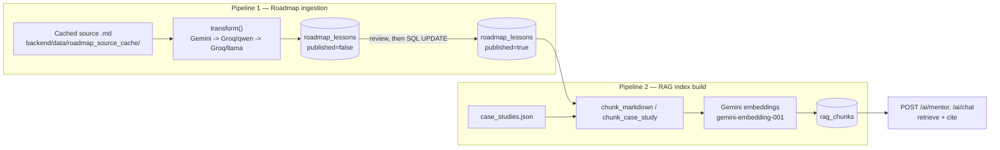

# Content & retrieval pipelines — step-by-step reference

Two offline, rerunnable pipelines turn raw material into what the deployed
app actually serves. Both are one-shot CLI scripts against the **production**
database (not a request-time code path), both are idempotent, and both were
run live end-to-end on 2026-07-30 to take `production` from 62/76 published
lessons and an empty RAG index to 76/76 published and a fully populated
index. This doc is the reusable "how do I run this again" reference; the
narrative of what actually happened running them is
`backend/BACKEND_LOG.md` (2026-07-30 entries); the architectural *why*
behind the RAG design is `docs/RAG.md`.



---

## Pipeline 1 — Roadmap content ingestion

**What it does:** takes one reference article per "day" of the curriculum,
has an LLM rewrite it into an original SystemSim lesson (never stores the
source verbatim — see `CLAUDE.md`'s copyright-safety decisions), and
upserts it into `roadmap_lessons`.

**Script:** `backend/services/roadmap_ingest.py`

### Steps, in order, for one `--days` invocation

1. **Resolve source files.** `source_index()` maps day number → path in the
   source GitHub repo (`ROADMAP_SOURCE_REPO` env, defaults to the Sunchit
   Dudeja series). `fetch_source()` downloads and caches each file to
   `backend/data/roadmap_source_cache/day<N>.md` (gitignored) — a re-run
   for the same day never re-hits the network.
2. **Transform — the three-tier provider chain** (`transform()`):
   1. **Gemini** (`services/gemini.py`, `generate_json`) — generous context
      window, no source truncation needed, empirically the best writer for
      this prompt.
   2. **Groq / `GROQ_INGEST_MODEL`** (qwen) — reached only if Gemini raises
      `AIUnavailable` (quota, overload, no key). Prompt + reference is
      truncated to fit a 7,600 TPM budget (Groq's free-tier per-minute cap,
      checked per model).
   3. **Groq / `GROQ_MODEL`** (llama-3.3-70b) — last resort, not second
      choice: measured to write noticeably thinner lessons than qwen on
      this exact prompt, but it's a *separate* Groq rate-limit pool from
      qwen, so it's a real fallback exactly when qwen alone is exhausted.

   Each tier returns **strict JSON** (`title`, `subtitle`, `summary`,
   `reading_minutes`, `tags`, `key_takeaways`, `interview_angle`,
   `body_md`) via Gemini's `responseSchema` / a schema injected into the
   Groq prompt — never free-text parsing.
3. **Upsert** (`upsert()`) — resolves the lesson's curriculum module,
   slugifies the title into `day-<N>-<slug>`, writes/updates the
   `roadmap_lessons` row. `published` stays `false` unless `--publish` was
   passed.
4. **Resilience** (`ingest_days()`) — one day's failure (network hiccup,
   malformed model JSON) is caught, logged, and skipped; the batch
   continues and prints a `--days <failed>` hint for a targeted retry. This
   is not theoretical — see "what actually happened" below.

### Commands

```bash
# Target production directly (DECISION 2026-07-30) — inline env var,
# never written to .env, so there's no risk of a later command
# accidentally running against production.
DATABASE_URL="<production direct connection string>" \
  python -m services.roadmap_ingest --days 54,55,56  # or "1-7", or "9"

# Review drafts before publishing (recommended — avoids a second, wasted
# AI call, since generation isn't deterministic):
psql "<production DIRECT string>" -c \
  "SELECT day, slug, title, published FROM roadmap_lessons WHERE day IN (54,55,56);"

# Publish for free — no redeploy, no second AI call:
psql "<production DIRECT string>" -c \
  "UPDATE roadmap_lessons SET published = true WHERE day IN (54,55,56);"

# Or skip review entirely for trusted content — one call does both:
DATABASE_URL="<production direct connection string>" \
  python -m services.roadmap_ingest --days 54,55,56 --publish
```

**Hard rule:** `ingest_days()` calls the AI provider for every day, every
invocation — there's no "just flip `published`" built into the script
itself. Running the same day twice (plain, then `--publish`) burns the
call twice and can produce a *different* lesson the second time. The SQL
`UPDATE` above is the only free publish path.

### What actually happened running this live (2026-07-30, 14 days:
54–63, 67, 71, 72, 74)

- Gemini's free-tier quota was **fully exhausted** — every single day hit
  the Gemini tier and fell through with a `429`.
- Groq/qwen intermittently returned malformed JSON (`400
  json_validate_failed` — a model-quality failure, not a quota one),
  falling through again.
- Groq/llama-3.3-70b caught every one of those as the last resort and
  succeeded for 13 of 14 days on the first pass.
- Day 57 hit a plain `TimeoutError` on the read — transient network, not a
  provider rejection. Retried alone (`--days 57`), succeeded immediately.
  The other 13 days were completely unaffected by that one failure, which
  is the entire point of the per-day try/except.
- Reviewed all 14 via the `SELECT` above (titles, slugs, word counts
  500–1,200 each — all sane), then published all 14 in one `UPDATE ...
  WHERE day IN (...)`. Result: **76/76 published** in `production`.

---

## Pipeline 2 — RAG index build

**What it does:** turns the published corpus (roadmap lessons +
`case_studies.json`) into searchable, embedded chunks in `rag_chunks`, so
`/ai/mentor` and `/ai/chat` can retrieve and cite real passages instead of
answering from the model's own recall alone. Full architectural rationale
(why no vector DB, why Gemini for embeddings, chunking strategy, citation
filtering) is `docs/RAG.md` — this section is the operational "how to run
it" companion.

**Script:** `backend/services/rag_index.py`

### Steps

1. **Chunk the corpus** (`desired_chunks()`) — every *published* roadmap
   lesson and case study is split by `chunk_markdown()` /
   `chunk_case_study()` (`services/rag.py`) on `##` heading boundaries,
   with paragraph-overlap for oversized sections and reader-instruction
   boilerplate ("Try it in the sandbox") excluded.
2. **Diff against what's stored** — every chunk carries a content hash.
   Unchanged hash → skip (no embedding call). New/changed → queue for
   embedding. No longer produced → delete. This is the idempotency
   guarantee: re-running after editing one lesson only touches that
   lesson's chunks; a crashed run resumes for free; running `build` twice
   in a row is a no-op.
3. **Embed** (`services/embeddings.py`) — Gemini `gemini-embedding-001`,
   `RETRIEVAL_DOCUMENT` task type, batched 16 at a time with pacing for the
   free-tier per-minute quota, L2-normalized to 768 dims.
4. **Commit in batches of 25**, not one transaction for the whole run (see
   the bug below) — each batch's `RagChunk` rows are written and
   committed before moving to the next.

### Commands

```bash
DATABASE_URL="<production direct connection string>" \
  python -m services.rag_index build          # incremental — only changed chunks embed
DATABASE_URL="<production direct connection string>" \
  python -m services.rag_index build --force  # re-embed everything
DATABASE_URL="<production direct connection string>" \
  python -m services.rag_index status         # chunk counts by type/model
```

### Two real bugs found running this live against `production` (2026-07-30)

**1. Bulk-insert SSL drop — fixed in `rag_index.py`.** The first run
embedded all ~400 changed chunks successfully (confirmed: every Gemini
call succeeded), then issued a **single `db.commit()`** for the entire
batch at the end. Neon's connection died mid-flush on that one large
multi-row `INSERT`:

```
psycopg2.OperationalError: SSL connection has been closed unexpectedly
```

Nothing had committed yet, so the whole batch of already-paid-for
embedding calls was lost on rollback. **Fix:** commit every 25 rows inside
the loop instead of once at the end. Smaller transactions don't trip
whatever Neon didn't like about the giant one, and — because the existing
content-hash diff already treats a committed row as "unchanged" on the
next run — a future crash mid-batch now only loses its uncommitted tail,
not the whole run. Re-running after the fix completed cleanly in three
separate batches (396 chunks, then 89 new ones after the 14 lessons
published, then 7 more after the fix below) with zero further drops.

**2. A pre-existing lesson silently indexed to zero chunks.** After the
main build, `status` showed 485 chunks instead of the expected ~492.
Diffing published lessons against indexed source slugs found day 76
(`day-76-designing-globally-unique-ids-for-sharded-databases`) missing
entirely. Its stored `body_md` had **zero real newline characters** — the
whole lesson was one line containing 121 literal `\n` escape sequences
instead of actual line breaks, so `chunk_markdown()`'s `##`-heading
splitter had nothing to split on and silently returned `[]`. This predates
the 2026-07-30 ingestion session (day 76 was ingested earlier) and was
invisible until RAG chunking exposed it — the row looked fine as a raw DB
string field. Fixed pragmatically: `body_md.replace('\n', '\n')` (literal
escape → real newline) directly against the stored row, verified it now
produces 7 chunks, then re-ran the index build. Root cause (likely a JSON
round-trip somewhere upstream that skipped a `json.loads`) wasn't chased
further since it didn't recur in any of the other 75 lessons.

### Final state (2026-07-30)

`rag_chunks`: **492 rows** — 471 roadmap + 21 case study, 83 source
documents, all on `gemini-embedding-001`. This is the first time the index
existed in `production` at all; before this, `/ai/mentor` and `/ai/chat`
answered from Groq with `grounded: false` on every question (§3.6 of
`docs/RAG.md`'s failure contract — a documented degradation, now retired
by actually building the index).

---

## Interview framing (30 seconds)

> Two offline pipelines feed the live app: an ingestion pipeline that runs
> reference material through a three-tier LLM provider chain (Gemini, then
> two separate Groq model pools) to produce original lessons, published to
> production via a cheap SQL flag flip rather than a second AI call; and a
> RAG index pipeline that chunks the published corpus on its own heading
> structure and embeds it with Gemini. Running both against the real
> production database — not just dev — surfaced two genuine bugs a purely
> local run never would have: Neon dropping the SSL connection on one
> giant multi-row insert (fixed by batching commits, which also made the
> existing idempotent-resume design actually reachable in practice), and a
> months-old lesson with escaped-not-real newlines that had been silently
> invisible to retrieval the whole time. Both were found by building the
> index for real, not by code review — which matters especially for RAG
> as an enhancement layer: it degrades quietly, so verifying it end to end
> against production data is the only way to know it's actually working.
